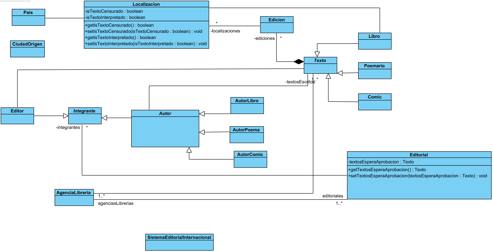

## Sistema Editorial Internacional
Este es un sistema diseñado para una editorial internacional que gestiona la producción, distribución y ventas de diferentes tipos de textos, como libros, poemarios y cómics.

### Funcionalidades del Sistema
El sistema ofrece una serie de funcionalidades tanto a nivel interno como externo para la editorial:

### Funcionalidades Internas:
* Crear un nuevo texto con autor, país, ciudad de origen, impresión, ediciones y editor que lo aprobó.
* Agregar ediciones a un texto.
* Buscar autores e información de las editoriales de las que son integrantes.
* Buscar las diferentes ediciones de un texto.
* Obtener lista de localizaciones de una edición.
* Solicitar aprobación de un texto en lista de espera.
* Acceder a los seudónimos del autor al buscar un autor.
### Funcionalidades Externas:
* Reabastecer a las tiendas.
* Aceptar ofertas de agencias.
* Ver el número de impresiones y ventas realizadas por texto.
### Clases Presentes en el Código:
* Agencia
* Autor
* AutorComic
* AutorLibro
* AutorPoema
* Ciudad
* Comic
* Edicion
* Editor
* Editorial
* Integrante
* Libro
* Localizacion
* Pais
* Poemario
* Sistema EditorialInternacional
* Texto
* Tienda

### Diagrama de Clases UML:

### Diagrama de Clases UML (borrador)
